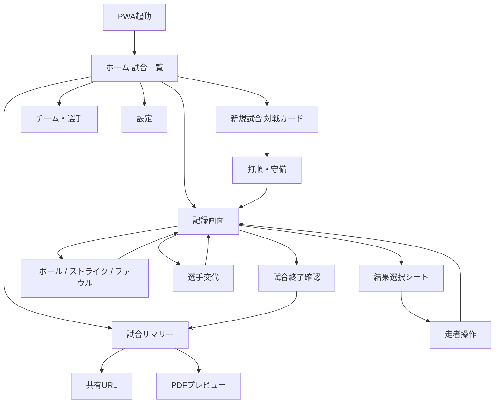
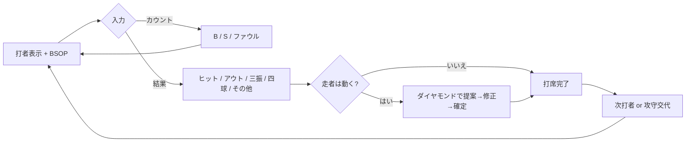
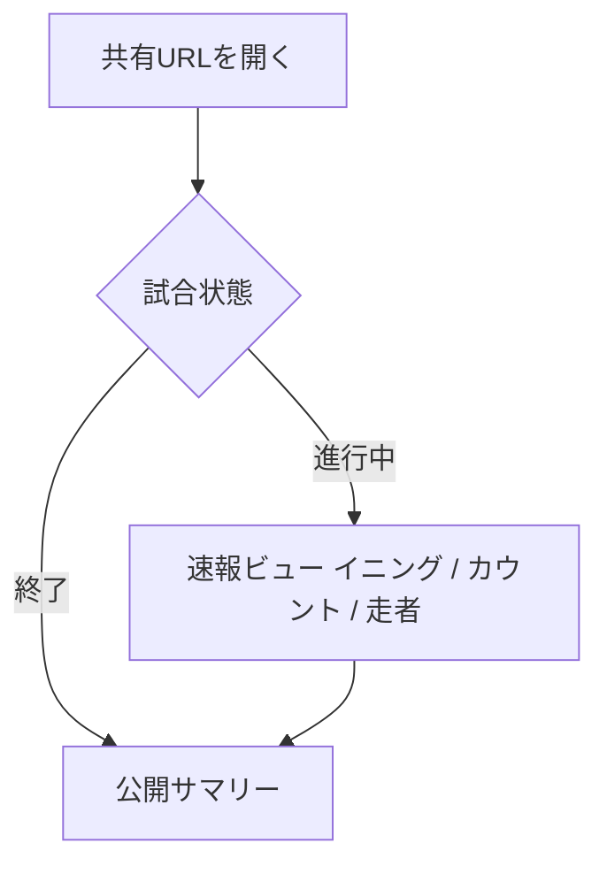

# らくスコア — 画面遷移・レイアウト・開発ロードマップ

> 学童・草野球の保護者／マネージャーが、スコアブック記号を知らなくても試合を記録・共有できる PWA。  
> 本書は基本設計の第1弾（画面遷移・主要レイアウト・MVP定義）。機能詳細・DB正規化は次稿。

---

## 0. 設計の北極星

記録の単位は「記号」ではなく **「今、何が起きたか」** である。

| 原則 | 実装への落とし込み |
|---|---|
| 結果ファースト | ボール／ストライクを入力しなくても、ヒット・三振・四球をタップすれば打席が完了する |
| 提案して確定 | 単打なら走者は「+1塁」を自動提案。違うときだけダイヤモンドを直す |
| 親指ゾーン | 主操作は画面下40%。屋外・片手・軍手でも届く 56px 以上 |
| 日光下で読める | ほぼ黒地に白文字。ボール=緑 / ストライク=黄 / アウト=赤 |
| 専門語は隠す | ボタンは「エラー」「送りバント」。正式名（E / SH / FC）は「これのこと？」に格納 |
| 失敗しても戻れる | 1球戻す / 打席ごと戻すを常時表示。確認ダイアログは出さない |

**推奨プロダクト名（仮）:** らくスコア  
**記録者 / 閲覧者** の2ロール。閲覧はログイン不要の共有URL。

---

## 1. 画面遷移図および主要画面のレイアウト構成案

### 1.1 情報アーキテクチャ（画面一覧）

```
記録者（PWA・オフライン可）
├─ ホーム（試合一覧）
│   ├─ 新規試合ウィザード
│   │    ① 対戦カード  →  ② 打順・守備  →  記録画面
│   ├─ 進行中の試合を再開 → 記録画面
│   └─ 終了した試合 → 試合サマリー
│        ├─ ビジュアルサマリー
│        ├─ 個人成績カード
│        ├─ JABA風スコアシート
│        └─ 共有 / PDF
├─ チーム・選手マスタ
└─ 設定（利き手、コントラスト、用語表示）

閲覧者（ログイン不要）
└─ 共有URL
     ├─ 試合中: テキスト速報ビュー
     └─ 試合後: 公開サマリー（OGP付き）
```

| ID | 画面 | 目的 | MVP |
|---|---|---|---|
| HOME | ホーム | 今日の試合に3タップで入る | ○ |
| GAME_NEW | 対戦カード | 日付・先攻後攻・チーム名だけ決める | ○ |
| LINEUP | 打順・守備 | 1〜9番とポジションを並べる | ○ |
| SCORE | 記録（コア） | カウント・走者・打席結果を入力 | ○ |
| PLAY | 結果シート | ヒットの種類・アウトの種類を選ぶ | ○ |
| RUNNER | 走者操作 | ダイヤモンド上で進塁を確定 | ○ |
| SUB | 選手交代 | 打順の差し替え | ○（最小） |
| SUMMARY | 試合サマリー | スコア・勝敗を確認 | ○（簡易） |
| GLOSSARY | これのこと？ | 用語の平易な解説 | △（コア用語のみ） |
| TEAM | チーム／選手 | 名簿の再利用 | ○ |
| LIVE | 速報ビュー | 遠隔の保護者が状況を見る | Phase 2 |
| SHARE | 共有設定 | URL発行・公開範囲 | Phase 2 |
| STATS | 個人成績カード | AVG / OBP 等 | Phase 2 |
| SHEET | JABA風シート | 伝統形式のプレビュー | Phase 3 |
| PDF | PDF出力 | A4・2形式 | Phase 3 |
| SETTINGS | 設定 | 利き手・ハイコントラスト | ○（最小） |

### 1.2 画面遷移（記録者）



記録画面内のループ（打席サイクル）は別フローとして固定する。ホームには戻さず、親指の届く位置で完結させる。



閲覧者フロー:



### 1.3 コア画面: 記録画面のレイアウト

屋外・縦持ち・片手を前提に、**上から「状況」→「ダイヤモンド」→「入力」** の3段にする。入力段を画面下40%に固定し、スクロールさせない。

```
┌─────────────────────────────────────┐
│  ←   3回表    先攻 0 — 2 後攻   共有 │  ① ヘッダー（48px）
├─────────────────────────────────────┤
│  B ● ○ ○    S ● ○    O ● ○ ○      │  ② BSOP（大きく、色分け）
│  投球 14     今の打者  3番 山田 一塁  │
├─────────────────────────────────────┤
│              ◆ 2塁                  │
│         3塁 /     \ 1塁             │  ③ ダイヤモンド
│              ■ 本塁  山田            │     走者は駒。進塁先をタップ
│         盗塁  暴投  捕逸  ボーク      │     走者専用アクションはここ
├─────────────────────────────────────┤
│  [ ボール ]  [ストライク]  [ファウル] │  ④ カウント（任意）
│  [ ヒット ]  [  アウト  ]  [ 三振  ] │  ⑤ 結果（主操作・64px）
│  [ 四球   ]  [  死球    ]  [ その他 ] │
│  ↩ 1球戻す          ↩ この打席を戻す  │  ⑥ Undo 常時表示
└─────────────────────────────────────┘
```

**配置の意図**

- ①は情報のみ。試合終了・交代は「⋯」に退避し、誤タップを防ぐ。
- ②の BSOP はスコアボードと同じ色（B緑 / S黄 / O赤）。数字ではなくドットで「今のカウント」を一眼で読ませる。
- ③は入力ではなく「盤面」。走者がいるときだけ強調する。
- ④は省略可能。初心者は使わず、⑤だけでも記録できる（結果ファースト）。
- ⑤の6ボタンがプロダクトの顔。ラベルは口語（「三振」「フォアボール」）。
- ⑥は破壊的なので二段構え（1球 / 打席）だが、確認ダイアログは出さない。誤操作前提で再入力の方が速い。

**利き手:** 設定でダイヤモンドとボタン列の左右を入れ替える（左利きのスコアラー向け）。

#### 結果選択シート（PLAY）

第1層の6ボタンを押した直後、必要なときだけ下からシートが上がる。

| 第1層 | 第2層（シート） | デフォルト進塁 |
|---|---|---|
| ヒット | シングル / ツーベース / スリーベース / ホームラン | +1 / +2 / +3 / 全員生還 |
| アウト | ゴロ / フライ / ライナー / 併殺 | 走者はそのまま（併殺は選択式） |
| 三振 | （任意）空振り / 見逃し / 振り逃げ | 変化なし。振り逃げ時のみ走者シート |
| 四球 | なし（即確定） | 打者→1塁。押し出しは自動 |
| 死球 | なし（即確定） | 四球と同じ |
| その他 | エラー / 野選 / 送りバント / 犠牲フライ / 打撃妨害 | エラー・野選は進塁を必ず確認 |

アウト・ヒットの「方向」は **任意**。MVPでは「内野 / 外野」または 1〜9 の大きいグリッド。番号の横に「ピッチャー」「ショート」と仮名を併記する。

#### 走者操作（RUNNER）

1. 結果に応じた進塁を **先に盤面へ描画**（提案）。
2. 違う場合のみ、走者駒をタップ → 行先ベースをタップ（またはドラッグ）。
3. 「この配置で確定」を押して打席完了。
4. 盗塁・暴投・捕逸・ボーク・牽制は打席結果ではなく、ダイヤモンド直下の走者アクションから入る。

衝突（同じ塁に2人）は物理的に置けなくし、文言は「その塁にはすでに走者がいます」。

#### 「これのこと？」

専門用語ボタンの右上に小さな「?」。タップでボトムシート。

- タイトルは口語（例: 野選）
- 1〜2文の定義（例: 「内野手がアウトにできた打球を、別の塁を狙って走者を生かしたとき」）
- 「こんなときに使う」1例
- スコアブック記号（FC）は末尾に小さく

MVPでは **野選 / 捕逸 / 暴投 / 犠打 / 犠飛 / 振り逃げ / ボーク** の7語だけ用意する。

### 1.4 その他主要画面の構成

**ホーム**  
今日進行中のカードを最上部に大きく（「試合を続ける」）。下に「新しい試合」「終わった試合」「チーム」。空状態のCTAは「最初の試合を作る」1つのみ。

**対戦カード（新規）**  
入力は最小: 自チーム（既存選択） / 相手チーム名 / 日付 / 先攻か後攻。イニング数はデフォルト7（学童）。場所・大会名は任意。

**打順・守備**  
1〜9を縦リスト。選手名をタップして名簿から選ぶ。守備は略称ではなく「ピッチャー」「ファースト」。同じ選手の重複はその場で赤表示。ベンチは下部。DHは Phase 4。

**試合サマリー（MVPは簡易）**  
イニングスコア表 + 合計点 / 安打 / 失策 + 勝敗。共有・PDF・成績カードはボタンだけ置いて Phase 2 以降で活性化してもよいが、MVPでは非表示の方が迷いが少ない。

**速報ビュー（Phase 2）**  
記録画面の「読む専用」。ヘッダー（回・点）+ BSOP + ダイヤモンド + 直近5打席のテキスト（例: 「3回表 3番 山田 レフト前ヒット 1点」）。操作ボタンは出さない。5〜10秒ポーリング、または WebSocket。

**公開サマリー / OGP（Phase 2）**  
A4サマリーと同じ情報をWebで。OGPは「チーム名 スコア 日付」を描画した静的画像（またはエッジで生成）。

**JABA風シート（Phase 3）**  
伝統グリッドは **見る専用**。入力UIにはしない。記号は内部イベントから生成する。

### 1.5 主要UIコンポーネント（実装単位）

| コンポーネント | 責務 | 備考 |
|---|---|---|
| `BsopBar` | B/S/O ドットと投球数 | 速報ビューと記録画面で共用 |
| `DiamondMap` | 走者表示・タップ/D&D進塁 | 提案モードと編集モード |
| `AtBatActionPad` | 6結果 + 3カウント | 親指ゾーン。用語は口語 |
| `UndoBar` | 1球 / 打席 | イベントスタックを pop |
| `PlayResultSheet` | 第2層の種類選択 | ヒット・アウト・その他 |
| `GlossarySheet` | これのこと？ | 7語のコンテンツは静的 |
| `LineupList` | 打順1〜9 + 守備 | ドラッグ並べ替え |
| `InningScoreTable` | イニング得点 | サマリー・速報で共用 |
| `GameHeader` | 回・表裏・スコア | 記録・速報・OGPの元データ |
| `ShareOgpCard` | SNSカード画像 | Phase 2 |
| `ScoresheetJaba` | 公式風グリッド | Phase 3・描画のみ |
| `StatsPlayerCard` | AVG/OBP/投球数 | Phase 2 |

状態の単一ソースは **試合イベントログ**（球・進塁・交代）。画面はログの投影。Undo = ログの pop。同期 = ログの追記。このモデルがオフライン PWA と速報の両方を成立させる。

---

## 2. 段階的な開発ロードマップ（MVPの定義）

判断基準: **「日曜日の学童の試合を、電波の弱いグラウンドで、保護者が最後まで記録し切れるか」**  
これを満たした時点が MVP。共有も PDF も、記録が完走できなければ無価値。

### 2.1 Phase 1 — MVP「記録できる」（目安 4週）

**ゴール:** オフラインの1台で、7回裏まで記録し、簡易スコアを見られる。

含まれるもの:

- PWA シェル（ホーム画面追加、縦固定）
- 屋外ハイコントラストテーマ、56px 以上の主ボタン
- チーム・選手マスタ（端末内）
- 対戦カード + 打順・守備
- 記録画面: BSOP、ダイヤモンド進塁（タップ必須、D&Dはあれば尚可）
- 結果ファースト（ヒット/アウト/三振/四球/死球/その他）
- カウント任意入力（ボール/ストライク/ファウル）
- 走者アクション最小セット: 盗塁、暴投、捕逸
- Undo（1球 / 打席）
- イニング途中の攻守交代、試合終了
- 選手交代（打順の差し替えのみ）
- 簡易サマリー（イニング表 + R/H/E）
- IndexedDB への自動保存（通信不要）
- 「これのこと？」7語

意図的に入れないもの:

- アカウント、クラウド、共有URL、速報
- PDF / JABAシート / OGP
- 打率などの個人成績
- 配球チャート、コース入力
- DH、再出場の複雑な学童ルール、守備シフト
- 同時に2人が記録する競合解決

**MVP完了条件（受け入れ）**

1. 電波オフで試合を開始〜終了できる。
2. ヒット・三振・四球・ゴロアウト・エラー・盗塁が、記号知識なしで入力できる。
3. 満塁四球の押し出し点が自動で入る。
4. 誤タップを Undo 2回以内で訂正できる。
5. リロード（またはPWA再起動）後に同じ打席から再開できる。

### 2.2 Phase 2 — 「見せられる」（目安 3週）

記録中のデータをクラウドへ同期し、遠隔の保護者が見られるようにする。

- 軽量認証（マジックリンクまたはチームPIN）
- イベントログの同期（オンライン復帰時のキュー送信）
- 閲覧専用URL（`/s/:token`）
- 速報ビュー（イニング・点・BSOP・走者・直近テキスト）
- 公開サマリー
- OGP画像（スコアカード）
- 個人成績カード（打率・出塁率・打点・盗塁、投手は投球数・ストライク率）
- 用語解説の拡充

同期の方針: **イベントの追記のみ**（編集は Undo で新イベント）。競合は「記録者は1人」を前提にし、同時記録は Phase 4。

### 2.3 Phase 3 — 「残せる」（目安 2週）

- ビジュアルサマリー PDF（A4・1枚、試合結果・打者成績・イニング表）
- JABA公式風スコアシート PDF（A4・1枚、見る専用）
- 印刷プレビュー（レスポンシブではなく A4 固定レイアウト）
- 成績カードの画像保存

PDFは記録UIと分離し、イベントログ → ビューモデル → 印刷CSS の一方向にする。

### 2.4 Phase 4 — 「続けられる」（以降）

- ダイヤモンドのドラッグ＆ドロップ完成度、利き手レイアウトの実地調整
- 併殺のガイド、振り逃げ、ボーク、打撃妨害などの稀なプレイ
- シーズン通算、複数試合の選手成績
- DH / 再出場（学童） / 指名ランナー
- リアルタイム WebSocket
- 複数デバイスでの記録ロック
- アクセシビリティ（VoiceOver、更大ボタンモード）

### 2.5 推奨技術スタック（MVP）

| 層 | 推奨 | 理由 |
|---|---|---|
| フロント | Next.js (App Router) + TypeScript | PWA、共有URL、OGP、PDFを同一コードベースで |
| UI | 自前コンポーネント + 大きめトークン | 屋外コントラストをデザインシステムの中心にする |
| ローカル | IndexedDB（Dexie） | イベントログとマスタをオフライン永続化 |
| 状態 | 試合イベントログを SSOT | Undo・同期・速報が同じモデル |
| 同期（P2〜） | PostgreSQL + 行レベル認可 | 共有トークンは試合に紐づく秘密URL |
| PWA | Serwist / Workbox | アプリシェル + 試合データのキューイング |
| PDF（P3） | 印刷CSS または React-PDF | A4固定。画面用レイアウトを流用しない |

### 2.6 今決めておくこと / 後でよいこと

**今決める**

- 記録者は試合あたり原則1人
- 入力はイベントログ（破壊的UPDATEをしない）
- 初心者向け口語ラベルを正式名称より優先する
- MVPは端末ローカル完結（アカウントなしで価値が出る）

**後でよい**

- 配球のコース、球種
- 守備番号の厳密な公式記号生成ルールの全網羅
- シーズン・複数チームの権限設計
- ネイティブアプリ

---

## 次の成果物

承認後、第2弾として以下を書く。

1. 機能一覧（画面×イベントの詳細）
2. イベントログを中心にした DB 設計（ER、同期、共有トークン）
3. 主要コンポーネントの状態遷移（打席ステートマシン）
